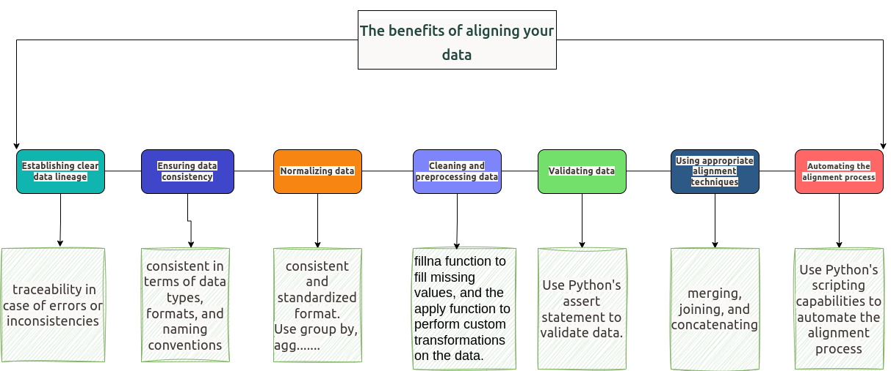

When talk about “data alignment” in data engineering, we might be referring to one of the three things.

- Arranging data elements in memory for more efficient execution
- Aligning or realigning datasets to maintain a coherent data structure
- Transforming datasets to ‘align’ with specific logical or business rules

# Data alignment definition 1: Arranging data elements in memory

The first use of the term "data alignment" refers to **the arrangement of data elements in memory to optimize performance and memory usage**. It ensures that data is stored in memory in a manner that is suitable for efficient access and processing, so this is a very valuable practice in data engineering and optimizing data pipelines, especially at scale.

In Python, data alignment typically applies to data *structures* such as arrays, structures, or objects. The alignment rules specify how individual data elements within these structures are positioned in memory. The alignment can affect the size and layout of the data, as well as the speed of accessing and manipulating it.

**`A (somewhat contrived) example of the benefits of data alignment using NumPy:`**

```python
import numpy as np
import time

# Create a large list with a million elements
list_data = [i for i in range(10**6)]

# Create array using numpy
numpy_data = np.array(list_data)

# Measure the time to square all elements in the list
start_time_list = time.time()
list_square_data = [i**2 for i in list_data]
end_time_list = time.time()

# Measure the time to square all elements in the arry
start_time_array = time.time()
array_square_data = numpy_data ** 2
end_time_numpy = time.time()

print(f"Time taken to square a list: {end_time_list - start_time_list} seconds")
print(f"Time taken to square a numpy array: {end_time_np - start_time_np} seconds")
```

→ Output

```sql
Time taken to square a list: 0.20438814163208008 seconds
Time taken to square a numpy array: 0.0013937950134277344 seconds
```

When you run this code, you'll find that squaring each element in the NumPy array is considerably faster than squaring each element in the list. This difference is partly due to how the data in the NumPy array is aligned in memory, making it more efficient for this type of operation.

Again, it's not possible to directly control data alignment in Python code. Still, it's crucial to understand how the language and libraries you use handle data alignment so you can design your code to take advantage of it. That's an integral part of designing efficient data pipelines and other data engineering tasks and is valuable for your depth of knowledge as a data engineer.

# Data alignment definition 2: ensuring merged datasets have consistent dimensions.

When working with data, we are often required to merge two datasets, but these may have different dimensions.

### The benefit of aligning your data:



### **Example of data alignment (definition 2) in Python using Pandas**
